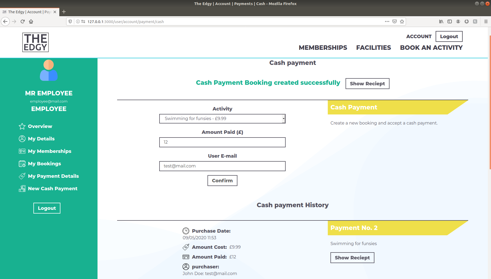
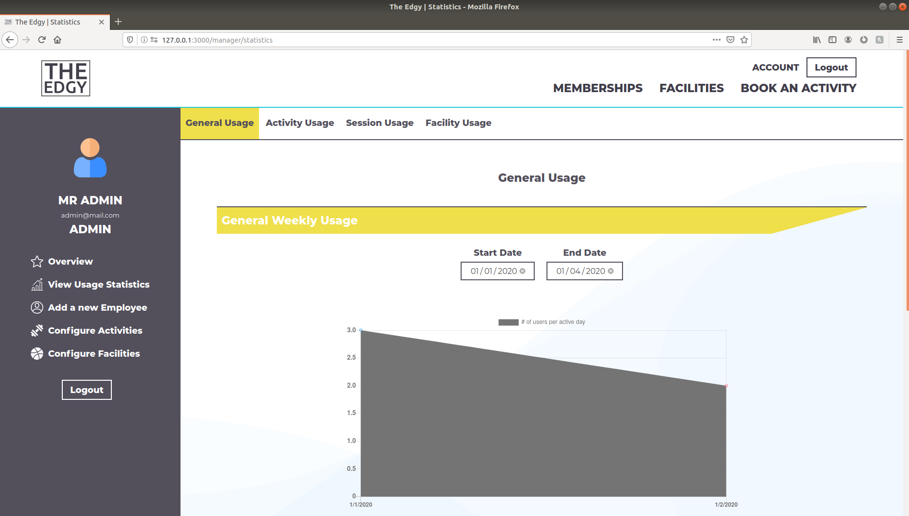
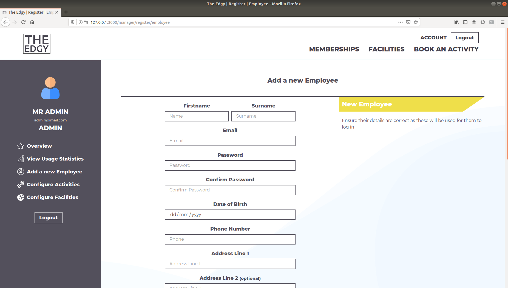
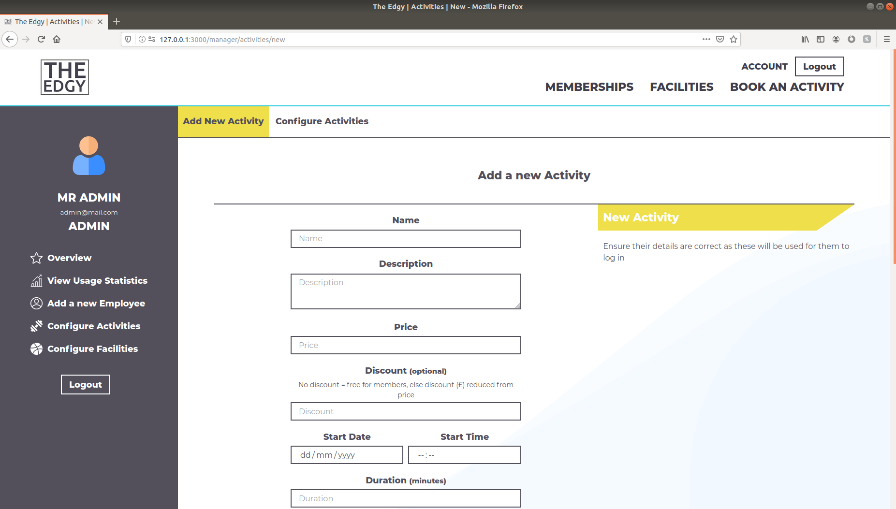

# EDGY GYM Employee Guide

### Employees:
* [Cash Payment](Employee User Manual#cash-payment)

### Administrators:
* [Usage Statistics](Employee User Manual#usage-statistics)
* [Add Employees](Employee User Manual#add-employees)
* [Configure Site](Employee User Manual#configure-site)

# Employees
## Cash Payment
Employees logged in to the EDGY Gym website can create new bookings for users through cash payments by entering all of the details manually at [https://the-edgy.herokuapp.com/user/account/payment/cash](https://the-edgy.herokuapp.com/user/account/payment/cash).

Receipts for all cash bookings made by an employee can be retrieved at the bottom of the page.

# Administrators

## Usage Statistics
Administrators can view different usage statistics of the website and its facilities at [https://the-edgy.herokuapp.com/manager/statistics](https://the-edgy.herokuapp.com/manager/statistics).

Each statistic is charted on a graph over a specified period of time.

## Add Employees
Administrators can add new employees to the website at [https://the-edgy.herokuapp.com/manager/register/employee](https://the-edgy.herokuapp.com/manager/register/employee) by entering their details manually to create a new employee account.

## Configure Site
Administrators can add new activities and facilities to the website, as well as configure and delete existing ones at [https://the-edgy.herokuapp.com/manager/activities/new](https://the-edgy.herokuapp.com/manager/activities/new) and [https://the-edgy.herokuapp.com/manager/facilities/new](https://the-edgy.herokuapp.com/manager/facilities/new).

