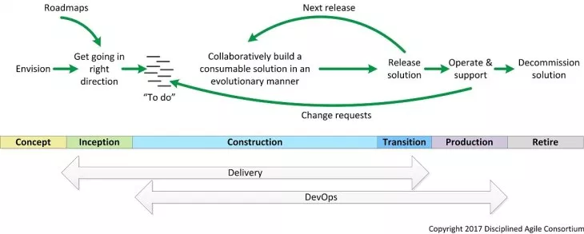

## Deployed!
* The Edgy Gym website was fully deployed at https://the-edgy.herokuapp.com/

## The Team
*  [Belbin Team Roles](Belbin Team Roles)

## Team Scrum Board
* https://trello.com/b/ddKnXNN8/sweng-scrumboard
* [Scrum Board History](Scrum Board History)

## Methodology

## Iterations

*  [Iteration 0: Concept Phase](Iteration 0/Concept Phase)
*  [Iteration 1: Inception Phase](Iteration 1/Inception Phase)
*  [Iteration 2: Construction Phase (users and security)](Iteration 2/Overview)
*  [Iteration 3: Construction Phase (bookings and site management)](Iteration 3/Overview)
*  [Iteration 4: Construction Phase (payment and finalisation)](Iteration 4/Overview)

## Testing

* [Unit Tests (Iteration 2)](Unit Tests)
* [User Interface Tests (Iteration 3)](User Interface Tests)
* [Functional Tests (Iteration 4)](Functional Tests)
* [Non-Functional Requirements](Non-Functional Requirements Tests)

## Manuals

* [Customer user guide](Customer User Manual)
* [Employee user guide](Employee User Manual)
* [Developer manual](Developer Manual/Overview)

## Reflection
* [End-of-project reflection](Reflection)

## Meetings
*  [Minutes](Meeting Minutes)

## Tools and help
*  [List of tools](Tools)
*  [NodeJS in 5 minutes](NodeJS in 5 minutes)