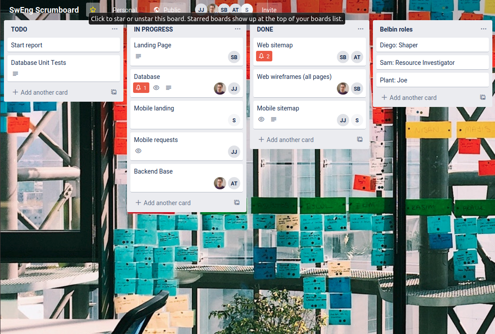
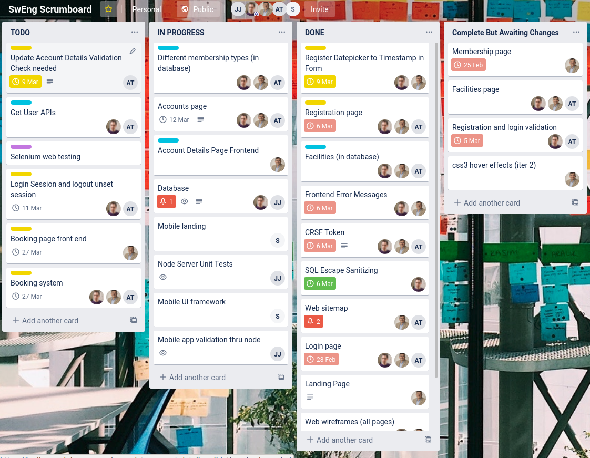
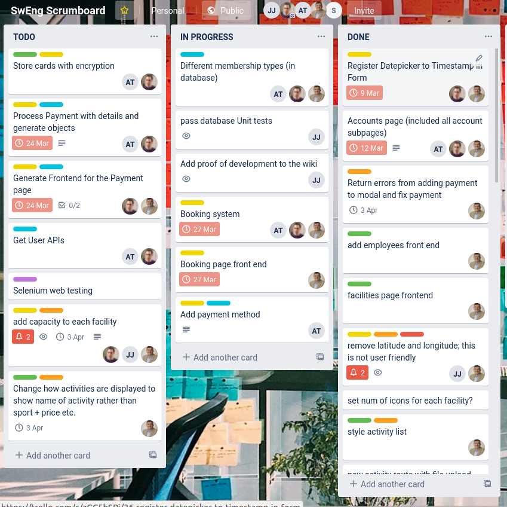
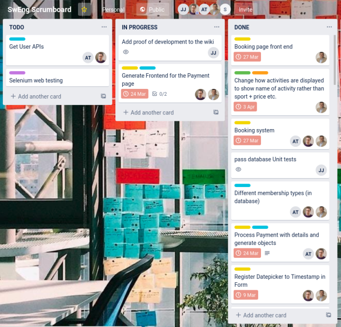

Trello was used to support Scrum Boards to keep track of features at each iteration. (link below)

https://trello.com/b/ddKnXNN8/sweng-scrumboard

as of 24/02/2020

as of 08/03/2020

as of 30/03/2020

as of 02/05/2020

