# User Interface Tests

## Design Patterns
With reference to lectures 5 and 9 of Tom Kelly's UI lectures, the website was observed
for UI patterns to justify a good User Experience (UX).

### 07/04/20 All pages
*  Home Link
*  Sign-in
*  Navigation tabs
*  Fat footer
*  Responsive design

### 07/04/20 Home page
* Carousel

### 07/04/20 Memberships page
* Middle option bias

## Visual Design
With reference to lecture 7 of Tom Kelly's UI lectures, the website was observed
for visual design to justify a good UX.

### 07/04/20 All pages
* blue, green and yellow colour scheme: promotes trust, safety and happiness
* consistent spacing between UI components throughout
* texture: shapes and shading for a clean appearance
* block font: conveys amazement

### 07/04/20 Home, Membership pages
* grouping: Z layout

### 07/04/20 Facilities, Activities, Account pages
* grouping: F layout

## Cognitive Walkthroughs
### 25/03/20 Booking a Kickboxing session next month
Steps taken from Home page:
1.  click on "Book an Activity"
2.  navigate to timetable
3.  click on a date to select a week view
4.  search each date for a kickboxing session
5.  repeat steps 3 and 4 until a kickboxing session is found
6.  click "Book" on the kickboxing entry
7.  click "Proceed to Payment" on the pop-up
8.  click activity on payment page to select it
9.  if a card exists skip to step 12
10. click add new payment method
11. enter card details
12. click card on payment page to select it
13. click "pay now" on order total
14. click "confirm payment" on the pop-up

Feedback:
*  straightforward navigation between pages
*  good use of colour for grouping items
*  adequate feedback when hovering cursor over buttons
*  searching for kickboxing session using the timetable is cumbersome
*  too many steps when selecting activity and card on payment page

Action taken:
*  47e67d8671b5791a47a99ed46a83e588d255ebe8 upcoming activity filter added to make search easier
*  728602f28b47198e05dcbf66f41de41e6ddf3295 members can skip payment page completely

### 09/04/20 Registration and login
Steps taken from Home page:
1. click on "Login"
2. click on "Register"
3. Fill out fields
4. click "Next"
5. repeat 3 and 4 until clicking "Register"
6. auto-login

Feedback:
* No clear registration link from home
* "JOIN NOW" for membership may be mistaken for registration
* "Register" button blends slightly into background
* Straightforward navigation of registration form
* User-friendly auto-login

Action taken:
* issue #27 opened regarding "Register" buttons on Home and Login pages

### 09/04/20 Employee Cash Payment
Steps taken from Employee Overview Page 
1. Click on "new cash payment"
2. Fill out the fields
3. Click "confirm"
4. Redirects to cash payment receipt

Feedback: 
* Redirecting to receipt after payment may be annoying if they don't need it (customer doesn't want it)
* Straightforward navigation to cash payment page
* Easy to fill our form and submit

Action Taken:
* 43e19113feb7a07559d7c18ad4134158b5c819f8 Button to show receipt after payment made and all receipt permanently available 
in cash payment history

### 09/04/20 Admin create new Activity / facility
Steps taken from Admin overview page
1. Click on "Configure Activities" / "Configure Facilities"
2. Fill out the fields
3. Click "Add"

Feedback:
* Straightforward navigation to add new facilities and activities 
* Both forms require the input of an image(s), even when these are not necessarily  required 
* Easy to fill out forms and submit 
* No way to edit the data in the activities and facilities, including images 

Action Taken:
* 3b3cd799c37e313b32400d7c3ab8319f42cd262c Allow existing activities and facilities to be edited / deleted
and make uploading images an optional field

## adaptability testing 
With reference to lecture 3 of Tom Kelly's UI lectures, the website was observed for
adaptable (responsive) design for UI Design Pattern vi) Responsive design for the web

### 08/05/20 All Pages - header
#### header large display

#### header medium display

#### header small display

Feedback:
* Good consistent spacing between elements, making use of a collapsable menu
* Header is responsive to all size screens, with no interfering elements
* Header may be too large on a small display, taking up much of the height of the display

### 08/05/20 All Pages - footer
#### footer large display 

#### footer medium display

#### footer small display

Feedback:
* Kept same style between all screen sizes consistently
* Makes good use of stacking elements to position relative to screen size
* No responsive issues, page adapts perfectly

### 08/05/20 All Pages - Modal
#### Modal large display
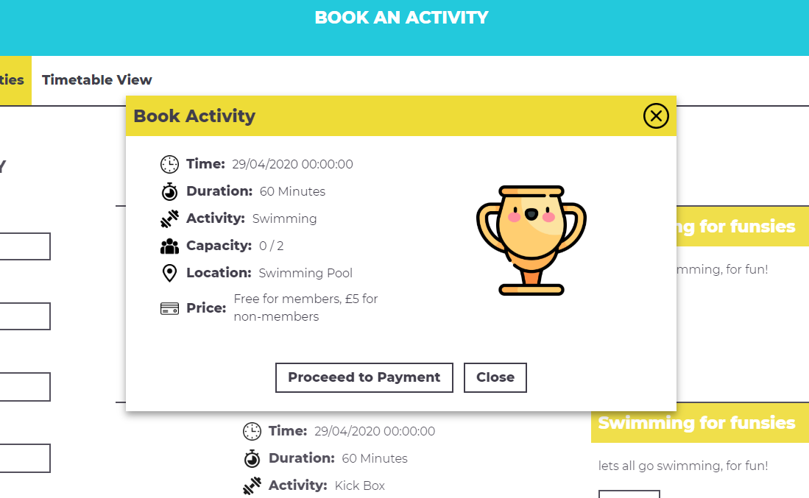

#### Modal medium display
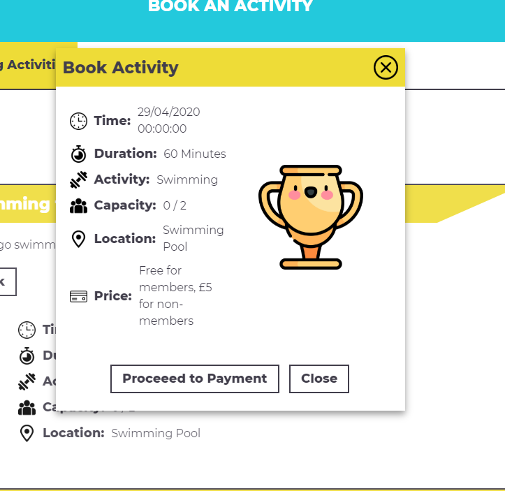

#### Modal small display
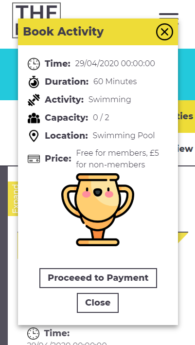

Feedback:
* Modal kept in the centre of the page on all display sizes and is never pushed off the page
* Modal uses collapsing content to stack under each other to make use of the smaller screen
* Modal correctly adapts to all screen sizes

### 08/05/20 Registration and Login
#### Registation and login large display
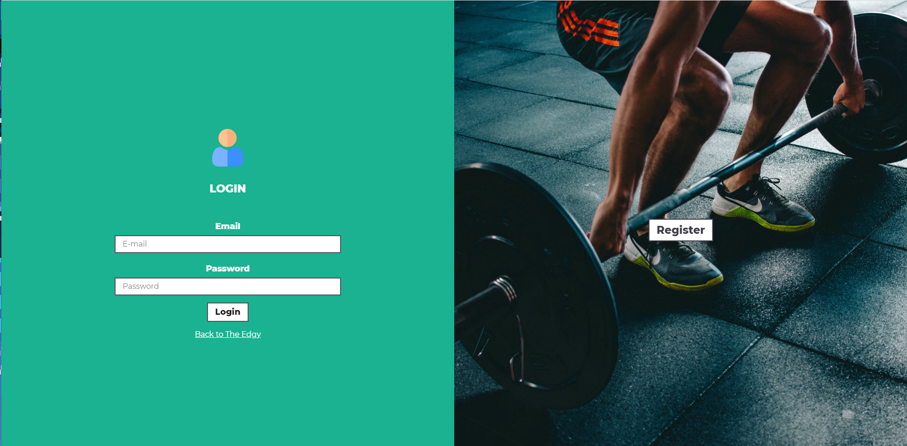

#### Registration and login medium display
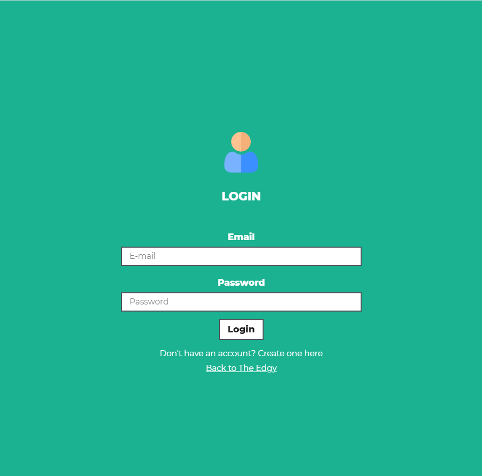

#### Registration and login small display
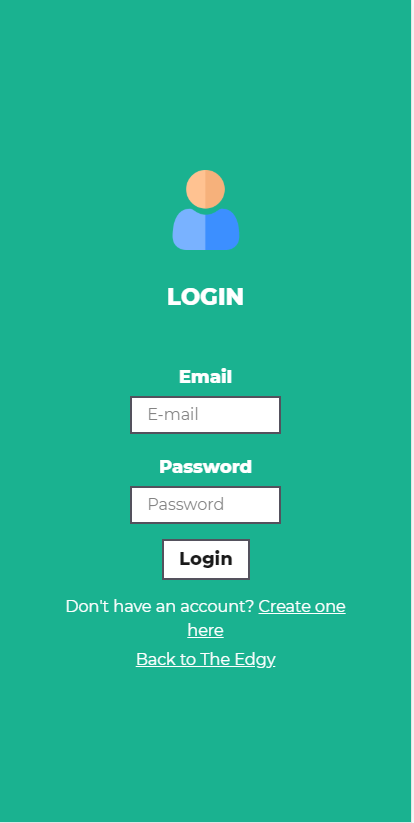

Feedback:
* Makes good use of collapsing containers to hide / show containers on different size screens
* Registration page moved to button on login on smaller screens, allowing login to span the full width
* Could possibly be hard for someone to find the registration page on medium and small displays,
as it is accessible just through a small button under login

### 08/05/20 Payment Page
#### Payment page large display
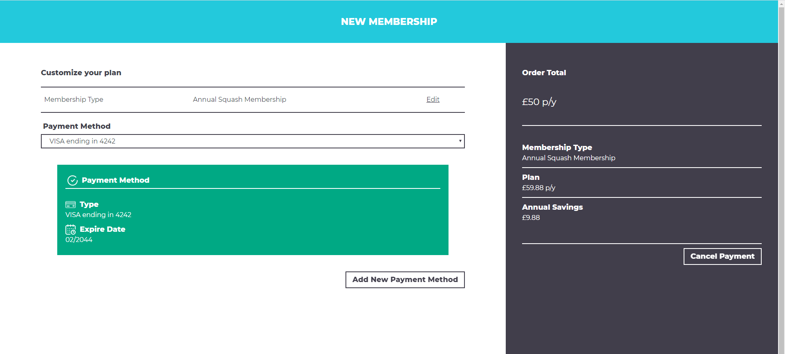

#### Payment page medium display
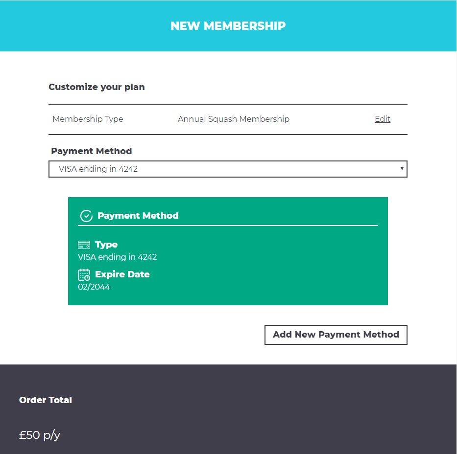

#### Payment page small display
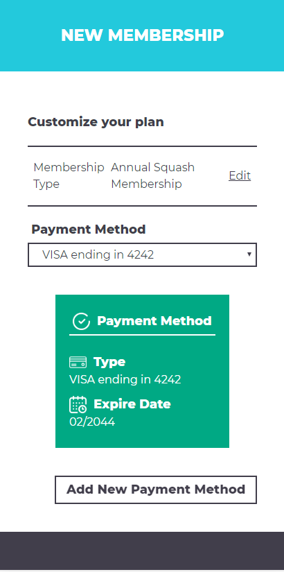

Feedback:
* Good use of collapsing containers to stack content instead of compressing it
* Style kept on all display sizes 
* All text is easily readable 
* Stacking order details under order options on smaller displays means users always have to 
scroll down to see it which may become cumbersome 
* Cancel order button all the way at the bottom of the page, which involves scrolling, on smaller displays

### 08/05/20 Account Page
#### Account page large display
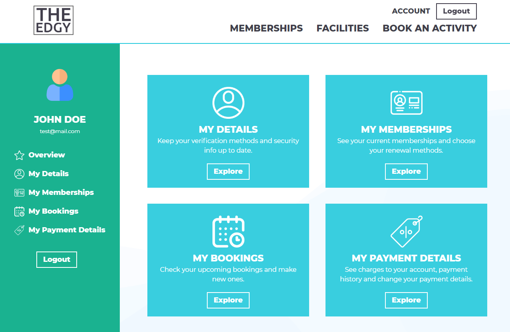

#### Account page medium display
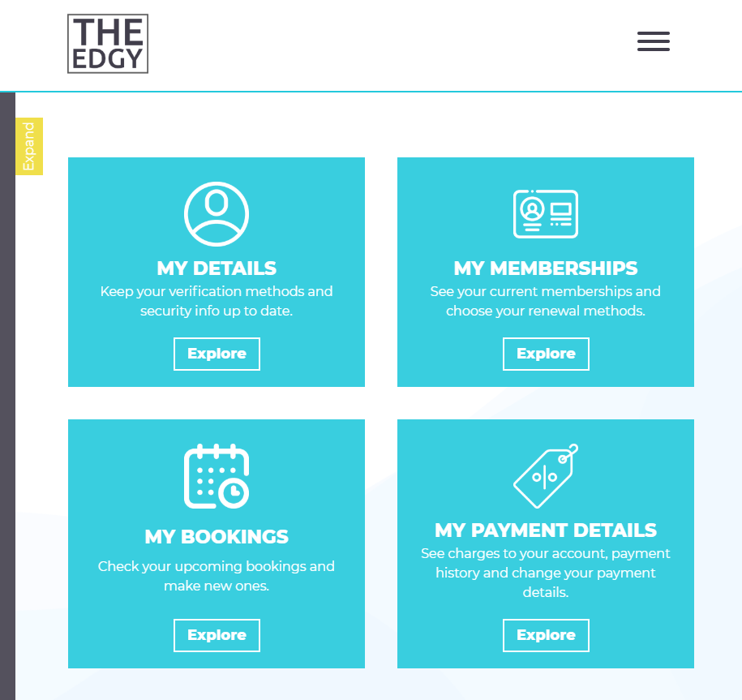

#### Account page small display

Feedback:
* Good use of 'cards' to stack content vertically on smaller display sizes
* Stacking cards allows the content within the cards to remain the same
* Good use of collapsing side navigation bar on smaller display sizes which can be opened or closed when needed
* Spacing remains the same on all display sizes